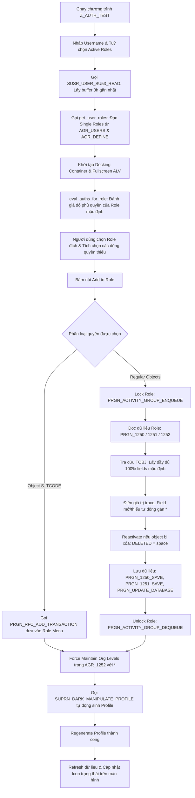

# Z_AUTH_TEST: SU53 Authorization Analyzer & Role Provisioning Cockpit

Chương trình ABAP **`Z_AUTH_TEST`** (`src/z_auth_test.prog.abap`) là một công cụ toàn diện dành cho Quản trị viên Phân quyền SAP (SAP Security & Authorization Admins). Chương trình tự động hóa toàn bộ quy trình: từ trích xuất lịch sử lỗi phân quyền SU53, phân tích độ phủ quyền của các Role hiện có, giả lập và tự động gán quyền/TCode trực tiếp vào Role, cho đến tự động sinh lại Profile.

---

## 📌 Mục lục
1. [Bối cảnh nghiệp vụ & Vấn đề giải quyết](#1-bối-cảnh-nghiệp-vụ--vấn-đề-giải-quyết)
2. [Kiến trúc giao diện Dual-Grid Cockpit](#2-kiến-trúc-giao-diện-dual-grid-cockpit)
3. [Luồng xử lý chi tiết (Detailed Workflow)](#3-luồng-xử-lý-chi-tiết-detailed-workflow)
4. [Giải thích chi tiết từng Subroutine & Khối Code](#4-giải-thích-chi-tiết-từng-subroutine--khối-code)
   - [4.1. Khởi tạo & Màn hình Selection Screen](#41-khởi-tạo--màn-hình-selection-screen)
   - [4.2. Đọc Buffer SU53 (`SUSR_USER_SU53_READ`)](#42-đọc-buffer-su53-susr_user_su53_read)
   - [4.3. Xác định Single Roles của User](#43-xác-định-single-roles-của-user)
   - [4.4. Giả lập & Đánh giá độ phủ quyền (`eval_auths_for_role`)](#44-giả-lập--đánh-giá-độ-phủ-quyền-eval_auths_for_role)
   - [4.5. Cơ chế Add to Role qua PFCG Function Modules](#45-cơ-chế-add-to-role-qua-pfcg-function-modules)
   - [4.6. Toàn vẹn dữ liệu: Bổ sung 100% Default Fields từ Bảng `TOBJ`](#46-toàn-vẹn-dữ-liệu-bổ-sung-100-default-fields-từ-bảng-tobj)
   - [4.7. Xử lý Authorization Object bị Deactivate (`DELETED = 'X'`)](#47-xử-lý-authorization-object-bị-deactivate-deleted--x)
   - [4.8. Force Profile Generation & Xử lý Organizational Levels (`AGR_1252`)](#48-force-profile-generation--xử-lý-organizational-levels-agr_1252)
   - [4.9. Xử lý Event & Điều hướng lệnh UI](#49-xử-lý-event--điều-hướng-lệnh-ui)
5. [Tổng kết các Function Module SAP chuẩn được sử dụng](#5-tổng-kết-các-function-module-sap-chuẩn-được-sử-dụng)
6. [Hướng dẫn Clone & Tự triển khai lên SAP Server (Deployment Guide)](#6-hướng-dẫn-clone--tự-triển-khai-lên-sap-server-deployment-guide)
   - [6.1. Clone Repository](#61-clone-repository)
   - [6.2. Cấu hình thông tin SAP Server của bạn](#62-cấu-hình-thông-tin-sap-server-của-bạn)
   - [6.3. Ba phương thức Deploy chương trình lên SAP](#63-ba-phương-thức-deploy-chương-trình-lên-sap)
   - [6.4. Tạo mã giao dịch Transaction Code (SE93)](#64-tạo-mã-giao-dịch-transaction-code-se93)
   - [6.5. Kiểm tra & Vận hành thực tế](#65-kiểm-tra--vận-hành-thực-tế)

---

## 1. Bối cảnh nghiệp vụ & Vấn đề giải quyết

### Vấn đề thực tế trong vận hành SAP:
1. **Hạn chế của transaction `SU53` chuẩn**: Chỉ hiển thị đúng lần kiểm tra thất bại cuối cùng trên Application Server hiện tại. Khi user gặp chuỗi lỗi phân quyền phức tạp (ví dụ khi chạy các nghiệp vụ mua hàng `ME21N`, duyệt đơn, chạy báo cáo), quản trị viên phải yêu cầu user thực hiện lại nhiều lần để chụp màn hình từng lỗi.
2. **Khó khăn khi tra cứu Role**: Quản trị viên phải mở `SU01` để xem danh sách Role, sau đó vào `PFCG` mở từng Role để kiểm tra xem object bị thiếu đã có trong role nào chưa, vì sao chưa hợp lệ.
3. **Mất toàn vẹn khi thêm thủ công (Manual Objects)**: Trong PFCG, nếu thêm một authorization object mà quên điền một field mặc định (ví dụ `S_ALV_LAYR` có các field `ACTVT`, `REPORT`, `HANDLE`, `LOG_GROUP`, nếu bỏ quên `LOG_GROUP`), object sẽ có trạng thái chưa hoàn thiện (tam giác vàng - Unmaintained). Hậu quả là **Profile Generator bị chặn, không thể sinh được Profile**.
4. **Vướng mắc Organizational Levels**: Khi thêm TCode hoặc Object vào role menu, các biến Org Level (như `$BUKRS`, `$WERKS`) nếu không được điền giá trị sẽ khiến Profile Generator raise lỗi `open_auths`.

### Giải pháp của `Z_AUTH_TEST`:
Cung cấp một màn hình Cockpit duy nhất: tổng hợp toàn bộ lỗi SU53 trong 3 giờ gần nhất, đối chiếu tự động với từng Role của User, cho phép chọn quyền thiếu và bấm 1 nút để tự động thêm vào Role và sinh lại Profile thành công 100%.

---

## 2. Kiến trúc giao diện Dual-Grid Cockpit

Giao diện chương trình được thiết kế theo mô hình **Dual-Grid** (hai bảng dữ liệu liên kết trên cùng một màn hình):

```
┌────────────────────────────────────────────────────────────────────────┐
│ TOP CONTAINER (cl_gui_docking_container): SINGLE ROLES LIST             │
│ [Add to Role]  [Select All]  [Deselect All]  [Refresh from SU53]       │
├────┬──────────────────┬────────────────────────────────────────────────┤
│Radio│ Role Name        │ Role Description                               │
├────┼──────────────────┼────────────────────────────────────────────────┤
│🔘  │ Z_ROLE_TEST      │ Test Authorization Role                        │
│⚪  │ Z_MM_PURCHASER   │ Purchasing Operations                          │
└────┴──────────────────┴────────────────────────────────────────────────┘
┌────────────────────────────────────────────────────────────────────────┐
│ BOTTOM AREA (REUSE_ALV_GRID_DISPLAY_LVC): MISSING AUTHORIZATIONS TRACE  │
├───┬──────┬────────────┬─────────────┬──────────────┬───────────────────┤
│Sel│Status│ Object     │ Field       │ Val Required │ Current in Role   │
├───┼──────┼────────────┼─────────────┼──────────────┼───────────────────┤
│[X]│ 🔴   │ S_ALV_LAYR │ ACTVT       │ 23           │                   │
│[X]│ 🔴   │ S_USER_GRP │ ACTVT       │ 03           │                   │
│[ ]│ 🟢   │ S_TCODE    │ TCD         │ ME23N        │ ME23N             │
└───┴──────┴────────────┴─────────────┴──────────────┴───────────────────┘
```

- **Top Grid (Docking Container - `go_docking`)**:
  - Gắn vào phía trên màn hình bằng `cl_gui_docking_container` với `extension = 150`.
  - Hiển thị danh sách Single Roles của User đích kèm nút chọn Radio Icon (`@06@` / `@05@`).
  - Thanh toolbar chứa các nút thao tác chính.
- **Bottom Grid (Fullscreen ALV Grid)**:
  - Hiển thị danh sách chi tiết các quyền bị thiếu trích xuất từ buffer SU53, sắp xếp giảm dần theo thời gian (giống SU53).
  - Checkbox `SEL`: Cho phép người dùng chọn dòng quyền cần thêm vào Role.
  - Icon Status:
    - 🟢 `@08@` (Xanh): Quyền đã có sẵn và hợp lệ trong Role đang chọn. Checkbox tự động bị Disable.
    - 🔴 `@0A@` (Đỏ): Quyền chưa có hoặc chưa đủ trong Role đang chọn. Checkbox mở cho phép tích chọn.

---

## 3. Luồng xử lý chi tiết (Detailed Workflow)



---

## 4. Giải thích chi tiết từng Subroutine & Khối Code

### 4.1. Khởi tạo & Màn hình Selection Screen
- **Khai báo màn hình** (Lines 100-140):
  ```abap
  PARAMETERS: p_uname TYPE usr02-bname DEFAULT sy-uname OBLIGATORY,
              p_actv  TYPE abap_bool AS CHECKBOX DEFAULT 'X'.
  ```
  - `p_uname`: Username cần kiểm tra phân quyền (mặc định là user đang đăng nhập).
  - `p_actv`: Chỉ lấy các Role đang còn hiệu lực theo ngày (`from_dat <= sy-datum <= to_dat`).

### 4.2. Đọc Buffer SU53 (`SUSR_USER_SU53_READ`)
- **Subroutine `get_missing_authorizations`** (Lines 165-280):
  - Tính toán timestamp 3 giờ trước bằng `cl_abap_tstmp=>subtractsecs`:
    ```abap
    GET TIME STAMP FIELD lv_from.
    cl_abap_tstmp=>subtractsecs( EXPORTING tstmp = lv_from secs = 10800 RECEIVING r_tstmp = lv_from ).
    ```
  - Gọi FM chuẩn SAP:
    ```abap
    CALL FUNCTION 'SUSR_USER_SU53_READ'
      EXPORTING
        iv_bname       = p_uname
        iv_from        = lv_from
        iv_all_servers = 'X'
      IMPORTING
        et_usr07_ext   = lt_su53_raw.
    ```
  - **Trích xuất field/value**: Hàm duyệt qua 10 cặp `fiel1..fiel10` và `val01..val10` của `usr07_ext`, bỏ qua các giá trị giả lập `dummyfield`, tra cứu diễn giải object từ bảng `TOBJT` theo ngôn ngữ đăng nhập (`sy-langu`) hoặc tiếng Anh (`E`).

### 4.3. Xác định Single Roles của User
- **Subroutine `get_user_roles`** (Lines 415-465):
  - Đọc từ bảng `AGR_USERS` theo username.
  - Kiểm tra bảng `AGR_DEFINE` để **loại trừ Collective Roles** (`kollektive = space`), chỉ giữ lại các Single Role có thể trực tiếp gán quyền.

### 4.4. Giả lập & Đánh giá độ phủ quyền (`eval_auths_for_role`)
- **Subroutine `eval_auths_for_role`** (Lines 525-635):
  - **Lọc loại trừ quyền bị Deactivate**:
    ```abap
    SELECT object, auth, field, low, high
      FROM agr_1251
      WHERE agr_name = @pv_role
        AND deleted  = ' '
      INTO TABLE @lt_role_flds.

    SELECT object, auth
      FROM agr_1250
      WHERE agr_name = @pv_role
        AND deleted  = ' '
      INTO TABLE @lt_role_objs.
    ```
    > 💡 **Điểm mấu chốt**: Thêm điều kiện `AND deleted = ' '` giúp chương trình không bị nhận diện sai các quyền đã bị tắt trong PFCG. Nếu object bị tắt, trạng thái hiển thị là 🔴 Thiếu quyền.
  - **So khớp logic AND/OR**: Một Authorization Instance (`auth`) trong role được xem là bao phủ lỗi khi nó thỏa mãn **tất cả** các field được kiểm tra trong lần trace đó (AND), và chỉ cần **bất kỳ** instance nào thỏa mãn là đạt (OR). Hỗ trợ kiểm tra giá trị chính xác, dấu đại diện `*`, và khoảng giá trị (`low <= value <= high`).

### 4.5. Cơ chế Add to Role qua PFCG Function Modules
- **Subroutine `add_selected_auths_to_role`** (Lines 875-1210):
  - Chỉ lọc những dòng có `sel = 'X'` và `is_in_role = abap_false`.
  - **Tách riêng Object `S_TCODE`**:
    Đối với quyền chạy transaction (`S_TCODE`), chương trình **không insert thẳng vào bảng AGR_1251** (vì làm vậy sẽ tạo ra manual object không chuẩn), mà đưa vào Menu của Role bằng FM:
    ```abap
    CALL FUNCTION 'PRGN_RFC_ADD_TRANSACTION'
      EXPORTING
        activity_group = pv_role
        tcode          = lv_tcode.
    ```
  - **Kiểm tra Enqueue Lock**:
    Trước khi chỉnh sửa role, chương trình khóa role lại:
    ```abap
    CALL FUNCTION 'PRGN_ACTIVITY_GROUP_ENQUEUE'
      EXPORTING
        activity_group = gv_selected_role
      EXCEPTIONS
        foreign_lock   = 1
        OTHERS         = 2.
    ```
    Nếu role đang bị người khác mở chế độ Edit trong PFCG (`sy-subrc = 1`), biến hệ thống `sy-msgv1` sẽ chứa chính xác Username đang giữ lock. Chương trình sẽ thông báo rõ ràng: *"Role X is locked by user Y. Please exit Edit mode in PFCG first..."*.

### 4.6. Toàn vẹn dữ liệu: Bổ sung 100% Default Fields từ Bảng `TOBJ`
Đây là tính năng quan trọng nhất đảm bảo role không bao giờ bị lỗi trạng thái Unmaintained:
```abap
  " Đọc toàn bộ các trường định nghĩa của Authorization Object
  SELECT SINGLE fiel1, fiel2, fiel3, fiel4, fiel5, fiel6, fiel7, fiel8, fiel9, fiel0
    FROM tobj
    WHERE objct = @ls_item-object
    INTO CORRESPONDING FIELDS OF @ls_tobj_def.

  " Duyệt qua tất cả các trường mặc định
  LOOP AT lt_def_fields INTO DATA(lv_df).
    READ TABLE ls_item-check_values INTO DATA(ls_scv) WITH KEY field = lv_df.
    IF sy-subrc = 0 AND ls_scv-value IS NOT INITIAL.
      lv_df_val = ls_scv-value.      " Trường có trong trace: lấy giá trị trace
    ELSE.
      lv_df_val = '*'.               " Trường không có trong trace / rỗng: gán '*'
    ENDIF.
    ...
  ENDLOOP.
```
- **Ví dụ**: Khi add object `S_ALV_LAYR` (bị lỗi `ACTVT = 23`, `REPORT = SAPLMEGUI`, `HANDLE = RIOV`, `LOG_GROUP = ''`):
  - `ACTVT` -> Nhận `23`
  - `REPORT` -> Nhận `SAPLMEGUI`
  - `HANDLE` -> Nhận `RIOV`
  - `LOG_GROUP` -> Nhận `*`
  - Cả 4 field đều hiện diện đầy đủ trong `AGR_1251`, object đạt trạng thái xanh hoàn toàn trong PFCG.

### 4.7. Xử lý Authorization Object bị Deactivate (`DELETED = 'X'`)
- Trong subroutine `ensure_role_auth` và vòng lặp cập nhật `lt_field_values`:
  ```abap
  <ls_auth>-modified = 'U'.
  <ls_auth>-deleted  = ' '.  " Xóa cờ xóa để reactivate object
  ```
  Nếu role đã có sẵn object này nhưng trước đó đang ở trạng thái Deactivate, chương trình sẽ tự động phục hồi lại thành Active và cập nhật các field tương ứng.

### 4.8. Force Profile Generation & Xử lý Organizational Levels (`AGR_1252`)
- **Subroutine `generate_role_profile`** (Lines 1595-1670):
  - **Tự động quét và điền Org Levels (`AGR_1252`)**:
    Khi thêm TCode hoặc Object vào role, các biến Organizational Level (như `$BUKRS`, `$WERKS`, `$EKORG`, `$VKORG`) có thể được tạo ra nhưng mang giá trị `null`. Chương trình tự động đọc qua `PRGN_1252_READ_ORG_LEVELS`, gán `low = '*'` cho các biến chưa có giá trị, và lưu lại bằng `PRGN_1252_SAVE_ORG_LEVELS` + `PRGN_UPDATE_DATABASE`.
  - **Gọi Profile Generator ngầm**:
    ```abap
    CALL FUNCTION 'SUPRN_DARK_MANIPULATE_PROFILE'
      EXPORTING
        activity_group        = pv_role
        fill_orgs_with_star   = 'X'    " Tự động điền * cho các Org Levels còn mở
        fill_fields_with_star = 'X'    " Tự động điền * cho các Field còn mở
        no_dialog             = 'X'    " Chế độ không mở popup UI
        rebuild_auth_data     = pv_rebuild
        generate_profile      = 'X'    " Yêu cầu sinh profile ngay
    ```
  - **Cơ chế Fallback**: Nếu `SUPRN_DARK_MANIPULATE_PROFILE` gặp cảnh báo, chương trình tự động gọi tiếp `PRGN_AUTO_GENERATE_PROFILE_NEW` với đầy đủ cờ `org_levels_with_star = 'X'` và `fill_empty_fields_with_star = 'X'`.

### 4.9. Xử lý Event & Điều hướng lệnh UI
- **Subroutine `on_user_command_roles` & `handle_user_command`**:
  - Tránh lỗi đệ quy Automation Queue của SAP GUI khi gọi `refresh_table_display` từ trong Event Handler của chính ALV Grid:
  - Event Handler phía trên (`on_user_command_roles`) chỉ đóng vai trò forward mã hàm bằng:
    ```abap
    cl_gui_cfw=>set_new_ok_code( e_ucomm ).
    ```
  - Callback trung tâm của màn hình chính (`handle_user_command`) tiếp nhận và thực thi toàn bộ các nghiệp vụ: `ADD_ROLE`, `SEL_ALL`, `DESEL_ALL`, `REFRESH`.

---

## 5. Tổng kết các Function Module SAP chuẩn được sử dụng

| Tên Function Module | Mục đích sử dụng trong chương trình |
| :--- | :--- |
| `SUSR_USER_SU53_READ` | Đọc toàn bộ lịch sử trace lỗi phân quyền SU53 từ buffer của người dùng. |
| `PRGN_ACTIVITY_GROUP_ENQUEUE` | Khóa Role trước khi chỉnh sửa dữ liệu phân quyền. |
| `PRGN_ACTIVITY_GROUP_DEQUEUE` | Mở khóa Role sau khi cập nhật dữ liệu. |
| `PRGN_RFC_ADD_TRANSACTION` | Thêm mã giao dịch (TCode) vào Menu của Role chuẩn PFCG. |
| `PRGN_1250_READ_AUTH_DATA` | Đọc danh sách các Authorization Object/Instance (`AGR_1250`). |
| `PRGN_1250_SAVE_AUTH_DATA` | Lưu danh sách các Authorization Object/Instance (`AGR_1250`). |
| `PRGN_1251_READ_FIELD_VALUES` | Đọc chi tiết các trường và giá trị phân quyền (`AGR_1251`). |
| `PRGN_1251_SAVE_FIELD_VALUES` | Lưu chi tiết các trường và giá trị phân quyền (`AGR_1251`). |
| `PRGN_1252_READ_ORG_LEVELS` | Đọc danh sách các biến Organizational Level (`AGR_1252`). |
| `PRGN_1252_SAVE_ORG_LEVELS` | Lưu danh sách các biến Organizational Level (`AGR_1252`). |
| `PRGN_UPDATE_DATABASE` | Xác nhận ghi dữ liệu Role xuống Database SAP. |
| `SUPRN_DARK_MANIPULATE_PROFILE`| Sinh (generate) Authorization Profile tự động ở chế độ background (dark). |
| `PRGN_AUTO_GENERATE_PROFILE_NEW`| Function Module dự phòng sinh Profile tự động. |
| `REUSE_ALV_GRID_DISPLAY_LVC` | Hiển thị bảng Fullscreen ALV Grid danh sách quyền thiếu. |

---

## 6. Hướng dẫn Clone & Tự triển khai lên SAP Server (Deployment Guide)

Bất kỳ lập trình viên hoặc quản trị viên SAP nào khi clone repository này về máy đều có thể dễ dàng triển khai chương trình `Z_AUTH_TEST` (hoặc các chương trình khác trong thư mục `src/`) lên hệ thống SAP riêng của họ.

### 6.1. Clone Repository
Mở Terminal / PowerShell và clone repo về máy:
```bash
git clone https://github.com/<your-username>/sap-abap-mcp-auth-test.git
cd sap-abap-mcp-auth-test
```

### 6.2. Cấu hình thông tin SAP Server của bạn
1. Sao chép file `.sap.env.example` thành file `.sap.env`:
   ```bash
   # Windows PowerShell:
   Copy-Item .sap.env.example .sap.env

   # Linux / macOS:
   cp .sap.env.example .sap.env
   ```
2. Mở file `.sap.env` và cập nhật thông tin máy chủ SAP của bạn:
   ```ini
   SAP_URL=https://your-sap-server.com:44310
   SAP_CLIENT=100
   SAP_AUTH_TYPE=basic
   SAP_SYSTEM_TYPE=onprem
   SAP_USERNAME=YOUR_USER
   SAP_PASSWORD=YOUR_PASSWORD
   SAP_LANGUAGE=EN
   SAP_MASTER_SYSTEM=DEV
   NODE_TLS_REJECT_UNAUTHORIZED=0
   ```
   > 🔒 **Lưu ý**: File `.sap.env` đã được `.gitignore` bảo vệ, tuyệt đối không commit file này.

---

### 6.3. Ba phương thức Deploy chương trình lên SAP

Bạn có thể lựa chọn 1 trong 3 phương thức dưới đây để đưa chương trình lên máy chủ SAP:

#### Cách 1: Sử dụng Script CLI tự động (Khuyên dùng - Nhanh nhất)
Repository đã tích hợp sẵn script tự động hóa [`scripts/deploy.js`](../scripts/deploy.js). Script này tự động gọi MCP Server qua ADT API để kiểm tra xem chương trình đã tồn tại hay chưa: nếu chưa có sẽ tự tạo mới trong package `$TMP`, nếu đã có sẽ ghi đè và kích hoạt (Activate) ngay lập tức.

1. Đảm bảo đã cài đặt Node.js (>= 22) và gói MCP server:
   ```bash
   npm install -g @mcp-abap-adt/core
   ```
2. Chạy lệnh deploy:
   ```bash
   npm run deploy
   # hoặc:
   node scripts/deploy.js src/z_auth_test.prog.abap Z_AUTH_TEST
   ```
3. Kết quả console hiển thị:
   ```text
   📦 Deploying Z_AUTH_TEST (66942 characters)...
   🔌 Starting SAP ADT MCP Server with environment: .sap.env
   🚀 Checking and deploying program Z_AUTH_TEST on SAP...
   ✅ Success! Program Z_AUTH_TEST updated and activated successfully.
   ```

#### Cách 2: Triển khai qua AI Assistant có kết nối MCP
Nếu bạn sử dụng **Grok Build**, **Google Antigravity**, **Claude Desktop**, hoặc **Cursor IDE** (đã cấu hình MCP Server theo `README.md`):
- Bạn chỉ cần mở khung chat AI trong thư mục dự án và gửi prompt:
  > *"Deploy chương trình trong src/z_auth_test.prog.abap lên hệ thống SAP với tên Z_AUTH_TEST và activate nó"*
- Trợ lý AI sẽ tự động đọc source code từ `src/` và gọi tool ADT (`UpdateProgram` / `CreateProgram`, `ActivateProgram`) để triển khai trong vài giây.

#### Cách 3: Triển khai thủ công qua SAP GUI hoặc Eclipse ADT
Nếu máy trạm không cài Node.js hoặc không dùng MCP:
1. Đăng nhập SAP GUI vào Client phát triển của bạn.
2. Mở transaction **`SE38`** (ABAP Editor).
3. Nhập tên chương trình: **`Z_AUTH_TEST`** -> Bấm **Create**.
4. Thiết lập:
   - **Title**: `SU53 Authorization Trace and Simulator`
   - **Type**: `Executable program` (1)
   - **Status**: `Test program` (T)
5. Bấm **Save** -> Chọn Package **`$TMP`** (Local Object) hoặc Package dự án của bạn.
6. Mở file [`src/z_auth_test.prog.abap`](../src/z_auth_test.prog.abap) bằng text editor bất kỳ, copy toàn bộ nội dung và dán vào cửa sổ SE38.
7. Bấm **Check Syntax** (`Ctrl + F2`) để kiểm tra cú pháp, sau đó bấm **Activate** (`Ctrl + F3`).

---

### 6.4. Tạo mã giao dịch Transaction Code (SE93)
Để người dùng hoặc chuyên viên bảo mật có thể chạy chương trình nhanh chóng:
1. Vào transaction **`SE93`**.
2. Nhập Transaction Code: **`ZAT`** -> Bấm **Create**.
3. Điền Short Text: `SU53 Role Assignment Simulator`.
4. Chọn radio button: **`Program and selection screen (report transaction)`** -> Bấm Enter.
5. Tại mục **Program**: điền `Z_AUTH_TEST`.
6. Tại mục **GUI Support**: tích chọn cả 3 mục (SAP GUI for Windows, SAP GUI for Java, SAP GUI for HTML).
7. Bấm **Save** (lưu vào `$TMP` hoặc transport request).

---

### 6.5. Kiểm tra & Vận hành thực tế
1. Mở SAP GUI và gõ lệnh: **`/nZAT`**.
2. Nhập **User** cần kiểm tra (ví dụ user đang gặp lỗi phân quyền khi thao tác nghiệp vụ).
3. Bấm **Execute** (`F8`):
   - Danh sách lỗi phân quyền trong 3 giờ gần nhất sẽ xuất hiện ở bảng dưới.
   - Danh sách các Single Role của user xuất hiện ở bảng trên.
4. Bấm chọn Radio icon của Role đích cần phân quyền.
5. Tích checkbox `[X]` các quyền thiếu cần cấp và bấm nút **`Add to Role`**:
   - Hệ thống tự động thêm TCode vào Menu hoặc thêm Authorization Object với đầy đủ 100% field chuẩn (`TOBJ`).
   - Tự động điền `*` cho các biến Org Level còn mở trong `AGR_1252`.
   - Tự động sinh Profile cho role mà không cần bất kỳ thao tác thủ công nào trong `PFCG`.

